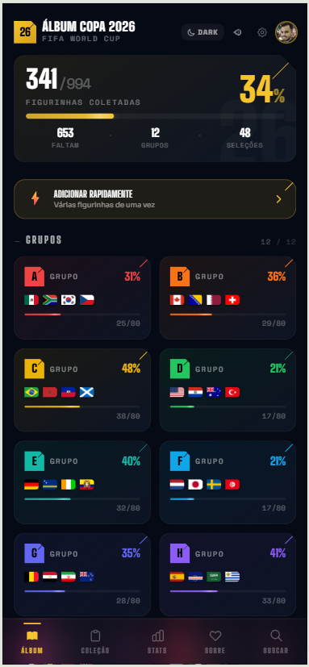
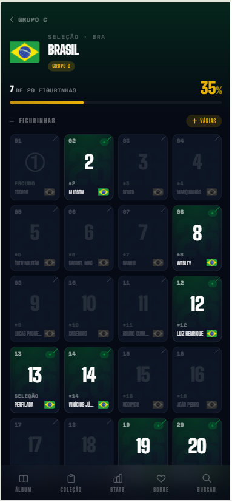
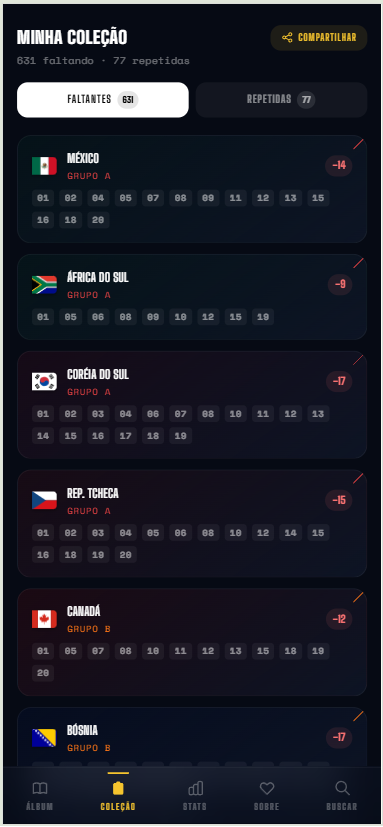
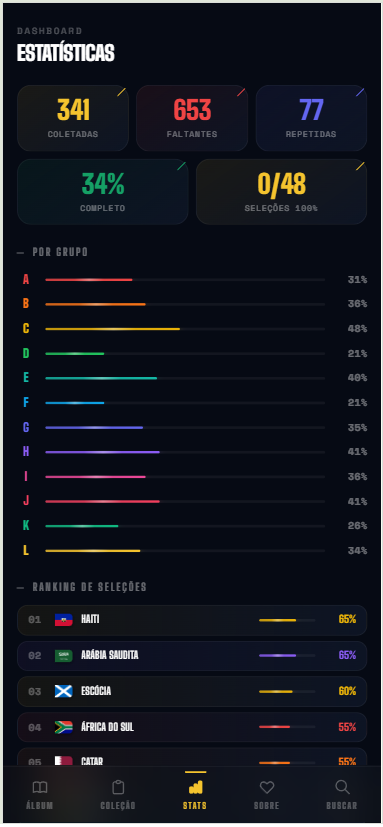
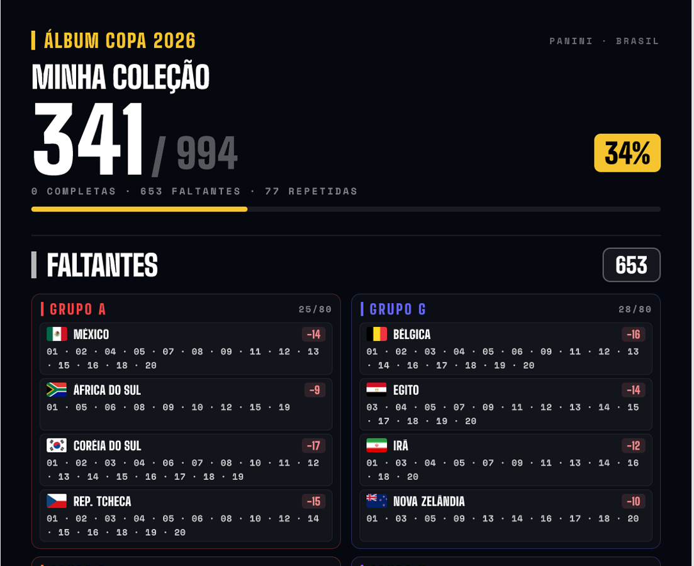

<div align="center">

# Meu Álbum Copa 2026

**Companheiro de bolso pro álbum Panini da Copa do Mundo 2026.**

Marque figurinhas, controle repetidas, encontre matches de troca e gere um PDF
organizado pra levar na banca, direto do celular, sem cadastro, sem ads.

[**→ meualbumcopa26.vercel.app**](https://meualbumcopa26.vercel.app/)

<br />


</div>

---

## Sobre

Toda Copa do Mundo, a mesma cena: dezenas de figurinhas espalhadas na mesa,
uma planilha do Excel meio travada, um caderninho mole no fundo da mochila.
A cada edição, a mesma fricção pra saber o que falta antes de descer pra trocar
na banca.

Esse app nasceu como uma planilha pessoal e virou um produto: você marca o que
tem, ele cuida do resto. Funciona 100% offline, sincroniza só se você quiser,
gera um PDF de uma página pra levar na banca e tem um sistema de trocas P2P que
encurta a conversa de "tem essa?" pra "manda o teu código".

Sem login obrigatório. Sem ads. Sem nada que você não autorize.

---

## Screenshots

<table>
  <tr>
    <td align="center" width="25%">
      
      <sub><b>Home</b><br/>Progresso e grupos</sub>
    </td>
    <td align="center" width="25%">
      
      <sub><b>Seleção</b><br/>Grid de figurinhas</sub>
    </td>
    <td align="center" width="25%">
      
      <sub><b>Coleção</b><br/>Faltantes e repetidas</sub>
    </td>
    <td align="center" width="25%">
      
      <sub><b>Stats</b><br/>Ranking por seleção</sub>
    </td>
  </tr>
</table>

<br />

<div align="center">
  
  <br/>
  <sub><b>Compartilhamento como card</b>, sua coleção inteira em uma imagem, pronta pra mandar no zap</sub>
</div>

---

## Features

#### Coleção
- 994 figurinhas mapeadas - 48 seleções × 20 + Copa History (20) + Coca-Cola (14)
- Toque para coletar, toque longo para gerenciar repetidas
- Adição rápida em lote pra quando você abre 10 pacotinhos de uma vez
- Busca instantânea por nome, número, seleção ou código

#### Trocas
- Sistema P2P por **código compartilhável**, sem precisar dos dois logados
- Matching automático por categoria (escudos, perfiladas, jogadores, especiais)
- PDF de uma página organizado por grupo, pronto pra imprimir ou mandar no zap

#### Compartilhamento
- **Card de coleção** em PNG (embrulhado em PDF pra não ser recomprimido pelo WhatsApp)
- **Stories 9:16** com QR code pra Instagram e feeds
- **Stories de repetidas**, só o que você tem em duplicidade, perfeito pra divulgar trocas
- **Lista** em PDF e mensagem em texto puro

#### Sincronização (opcional)
- Login com Google ou apelido + senha, escolha sua
- Sync automático com debounce de 1.5s e proteção contra perda de dados
- Histórico de versões com restauração visual (últimas 20 alterações)
- Indicador de status discreto no canto da tela

#### Polimento
- PWA instalável (manifest + ícones)
- Confete e fanfarra ao completar uma seleção
- Sons gerados pela Web Audio API (sem arquivos)
- Temas claro e escuro com persistência
- 359 testes cobrindo dados, store, sync e regras de negócio

---

## Diferenciais

**Velocidade primeiro.** O app é uma SPA leve com estado em memória, não tem
loading entre telas, não tem skeleton piscando. Você toca e a figurinha já
está marcada.

**Anônimo por padrão.** O login é opcional pra sempre. O app funciona 100% no
`localStorage` antes de ver um servidor. Quando você decide entrar, seus dados
sobem; se sair, ficam onde estavam.

**Mobile-first de verdade.** A interface foi desenhada pro polegar primeiro,
testada em telas pequenas em pé na fila do mercado. Versão desktop em
andamento, mas mobile não é fallback, é o caso principal.

**Sem fricção pra trocar.** O fluxo P2P resolve o problema do "tem essa?" sem
precisar dos dois usuários logados. Gera um código, manda, o outro lado abre e
vê o que combina. Acabou.

**Sync que protege seus dados.** Bug real em prod me ensinou: full-replace
sem proteção apaga histórico. O sync v2 detecta divergências catastróficas,
oferece reconciliação visual e nunca apaga sem confirmação. Soft-delete,
upserts incrementais, retry exponencial. [Detalhes técnicos →](./TECH_DECISIONS.md)

---

## Stack

| Camada | Ferramenta |
|---|---|
| Framework | [Next.js 14](https://nextjs.org/) (App Router) |
| Linguagem | [TypeScript](https://www.typescriptlang.org/) |
| Estilo | [Tailwind CSS](https://tailwindcss.com/) + CSS vars para temas |
| Estado | [Zustand](https://zustand-demo.pmnd.rs/) com middleware `persist` |
| Auth | [NextAuth.js](https://next-auth.js.org/) — Google OAuth + Credentials |
| Banco | [Supabase](https://supabase.com/) — PostgreSQL + RLS |
| Deploy | [Vercel](https://vercel.com/) |
| PDF | [jsPDF](https://parall.ax/products/jspdf) |
| Share images | [next/og](https://vercel.com/docs/functions/og-image-generation) + [Satori](https://github.com/vercel/satori) |
| Testes | [Jest](https://jestjs.io/) + [Testing Library](https://testing-library.com/) |

---

## Rodando localmente

```bash
git clone https://github.com/igorcezatte/album-copa-2026.git
cd album-copa-2026
npm install
npm run dev
```

Abra [localhost:3000](http://localhost:3000). O app já funciona sem nenhuma
variável de ambiente — login e sync ficam desabilitados, mas a coleção é
100% funcional via `localStorage`.

#### Variáveis de ambiente (opcional)

Copie `.env.local.example` para `.env.local` e preencha:

```env
NEXTAUTH_SECRET=                # node -e "console.log(crypto.randomBytes(32).toString('base64'))"
NEXTAUTH_URL=http://localhost:3000

GOOGLE_CLIENT_ID=               # console.cloud.google.com
GOOGLE_CLIENT_SECRET=

NEXT_PUBLIC_SUPABASE_URL=       # app.supabase.com
NEXT_PUBLIC_SUPABASE_ANON_KEY=
SUPABASE_SERVICE_ROLE_KEY=
```

Depois rode `supabase/schema.sql` no SQL Editor do Supabase pra criar as tabelas.

#### Comandos úteis

```bash
npm run dev          # dev server em :3000
npm run build        # build de produção
npm test             # 359 testes
npm run test:watch   # watch mode
npm run lint         # next lint
```

---

## Arquitetura

#### Dados
As 994 figurinhas são estáticas em `src/data/teams.ts` — carregadas em
build-time. Estrutura real do álbum: N1 = escudo, N2–12 = jogadores, N13 =
perfilada (foto da equipe), N14–20 = jogadores.

#### Estado
Zustand com `persist` mantém o álbum no `localStorage` sob a chave
`copa26-album-v1`. A estrutura é um `Record<stickerId, { quantity: number }>`
onde `stickerId` é `{TEAM_CODE}_{NUMBER}` (ex: `BRA_3`, `FWC_1`, `CC_14`).

#### Sync v2
Bug em produção (caso real: 220 → 76 figurinhas) levou ao redesenho. Soft
delete por `removed_at`, upserts incrementais por diff, recusa de shrinkage
catastrófico via guard 409 e modal de reconciliação. Cliente tem retry
exponencial, `fetch keepalive` em `pagehide` e auto-recovery em
`visibilitychange`.

#### Compartilhamento
PNG renderizado em Edge runtime via Satori (fontes inline base64, bandeiras
pré-carregadas em paralelo), embrulhado em PDF de uma página com jsPDF antes
do `navigator.share` — solução pro WhatsApp recomprimir imagens mas passar
PDFs intactos. Cache por hash do payload + geração proativa debounced fazem
o UX percebido ficar próximo de zero.

---

## Roadmap

- [x] MVP local (marcar, repetidas, busca, PDF, PWA, temas)
- [x] Auth opcional (Google + apelido) e sync com proteção v2
- [x] Sistema de trocas P2P por código compartilhável
- [x] Compartilhamento como card, stories e PDF
- [x] Histórico de versões com restauração
- [ ] **Versão desktop** completa (em andamento — fases 1 e 2 em prod)
- [ ] Trocas por busca de email/apelido (Supabase, requer ambos logados)
- [ ] Página `/imprensa` curta pra divulgação em grupos
- [ ] Open Graph image dinâmica (preview personalizado no WhatsApp)
- [ ] Otimização de bundle / lazy loading

---

## Contribuindo

Sugestões, bugs e ideias são muito bem-vindos. Abra uma
[issue](https://github.com/igorcezatte/album-copa-2026/issues) ou um PR — sem
template engessado, conta o que quer mudar e por quê.

Se for um PR de código:

- Mantenha o foco mobile-first
- Português brasileiro no produto
- `npm test` deve passar antes do push
- Decisões arquiteturais relevantes vão em [`TECH_DECISIONS.md`](./TECH_DECISIONS.md)

---

## License

[MIT](./LICENSE) - use, adapte, faça seu próprio.

---

<div align="center">

Feito por [Igor Cezatte](https://github.com/igorcezatte) - Engenheiro de
Computação, curte figurinhas desde criança.
